<p align="center">
  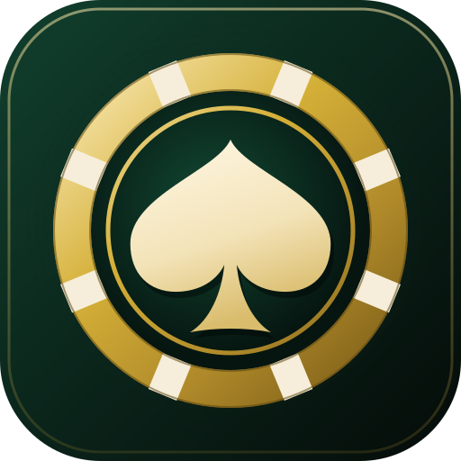
</p>

<h1 align="center">Shadowfetch Blackjack</h1>

<p align="center">
  A flagship 3D blackjack table for Linux — native Godot 4 / Vulkan, fully procedural, play money only.
</p>

<p align="center">
  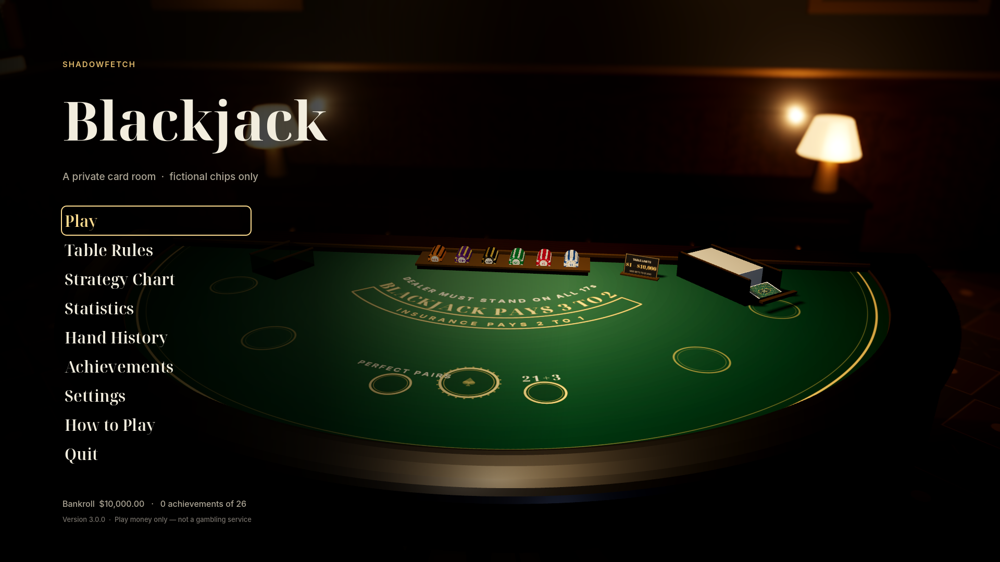
</p>

Take a seat at a private card room table: a padded semicircular table whose felt is painted from the live table
rules, a lamp-lit room, original art-deco cards and clay chips, a dealer that peeks, flips and sweeps, and chips that
are paid and collected by hand. Underneath is a rules engine with configurable house rules, side bets, a
basic-strategy coach, a Hi-Lo counting trainer, statistics, hand history and achievements — all backed by
400+ assertions and a 200,000-hand simulation.

**Everything is fictional.** There is no cash-out, no deposits and no real-money gambling.

**Version 3.0.0** · [Changelog](CHANGELOG.md) · [Architecture](ARCHITECTURE.md) · [Docs](docs/)

| Deal with side bets | Split, doubled card, coach |
| --- | --- |
| 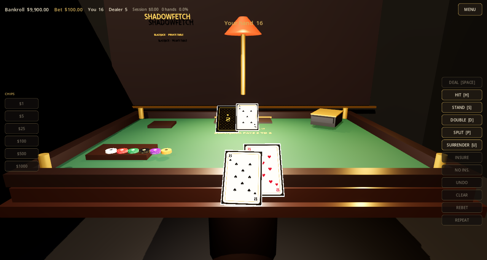 | 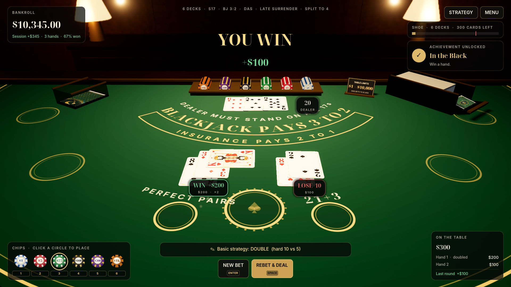 |
| **Blackjack** | **Overhead view with the count trainer** |
| 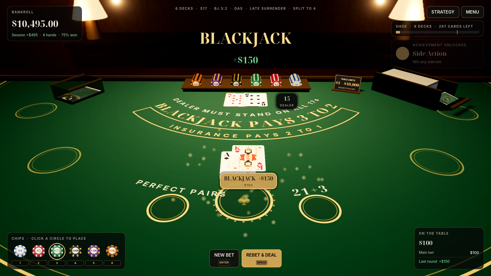 | 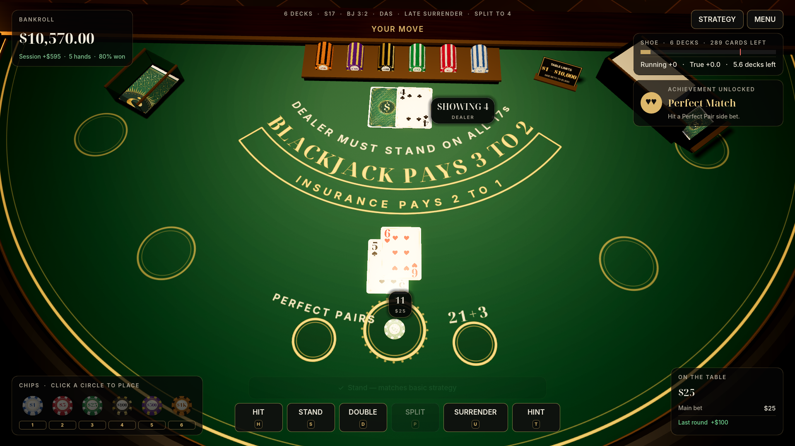 |

## Features

**The table**
- Semicircular table with a padded leather rail, brass trim and a felt whose printing (“Blackjack pays 3 to 2”,
  “Dealer must stand on all 17s”, insurance band, betting circles) is re-painted whenever the rules change.
- Original art-deco cards (classic or four-colour deck, four card-back designs) on rounded 3D card meshes; original
  clay chips with edge inserts; shoe, discard holder, dealer chip rack and table-limit placard.
- A lamp-lit private card room: pendant lamp with soft shadows, credenza lamps, wainscoting, framed art, a lit
  sign, a back bar and curtains. Depth of field, ambient occlusion, SSIL and volumetric light by quality tier.
- Seated and overhead cameras (toggle with **C**), a slow orbit behind the menus, breathing sway, mouse parallax,
  split-hand focus and a push-in for blackjacks — all switchable off with **Reduce motion**.

**The game**
- Dealt from the shoe in real order; hole card peek under an ace or ten; hole-card flip; dealer draws one by one;
  split hands receive their second card when played; doubled cards land sideways; cards are swept to the discard.
- Chips move like a real table: bets drop onto the circles, winnings are paid from the rack beside your bet,
  losses are collected, pushes returned.
- **Table rules:** 1/2/4/6/8 decks, S17/H17, 3:2 or 6:5, double after split, re-split aces, split to 2/3/4 hands,
  late surrender, shoe penetration, side bets on/off — with presets and a live house-edge estimate.
- **Side bets:** Perfect Pairs (25/12/6) and 21+3 (100/40/30/10/5), settled right after the deal.
- **Insurance and even money**, table limits $1–$10,000 (side bets to $1,000), a $10,000 fictional bankroll and a
  friendly rebuy when you run dry.
- **Strategy coach:** a HINT button for the basic-strategy play under the current rules, optional grading of every
  decision, a generated strategy chart, and lifetime strategy accuracy.
- **Card counting trainer:** Hi-Lo running count and true count of every card you have seen since the shuffle.
- **Statistics** with a session bankroll chart, **hand history** for the last 60 rounds, and **26 achievements**.
- A six-step first-run tour, full keyboard shortcuts and gamepad support.

**The sound**
- An original synthesized score (a lounge-jazz loop at the table, a nocturne in the menus), room ambience and
  30 synthesized effects: card slides, flips and taps, clay chip clacks, a riffle shuffle, payouts and results.

## Screenshots

| | |
| --- | --- |
| 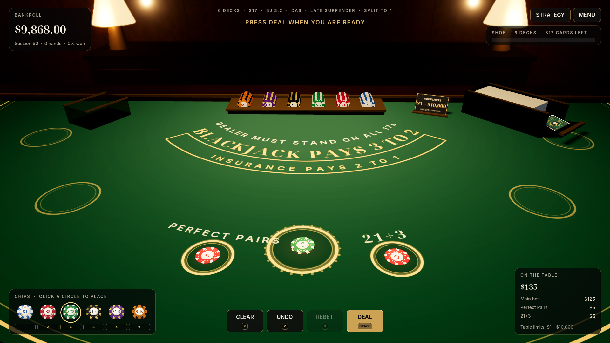 | 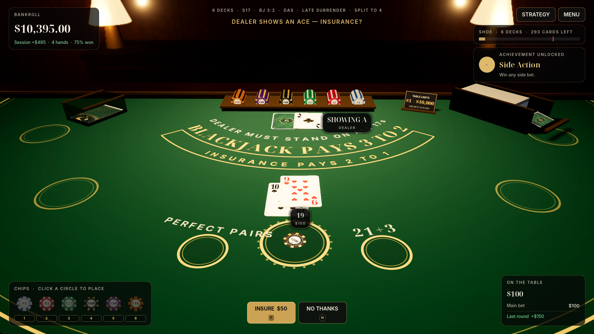 |
| 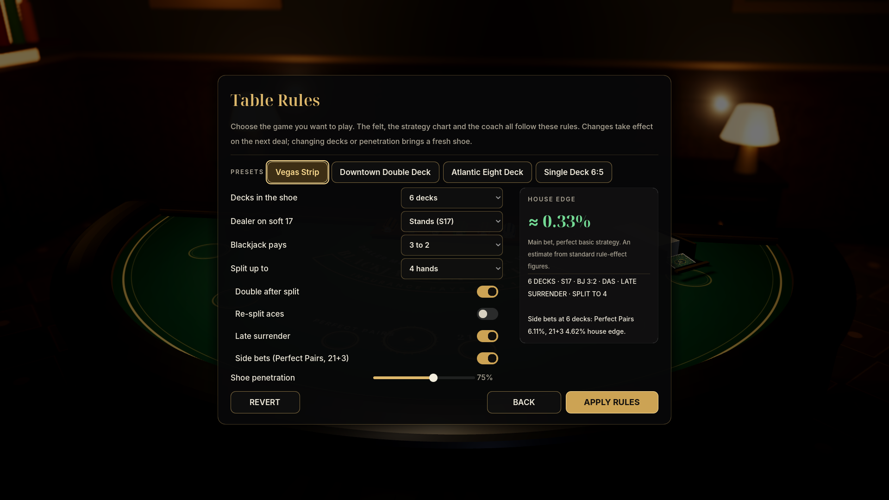 | 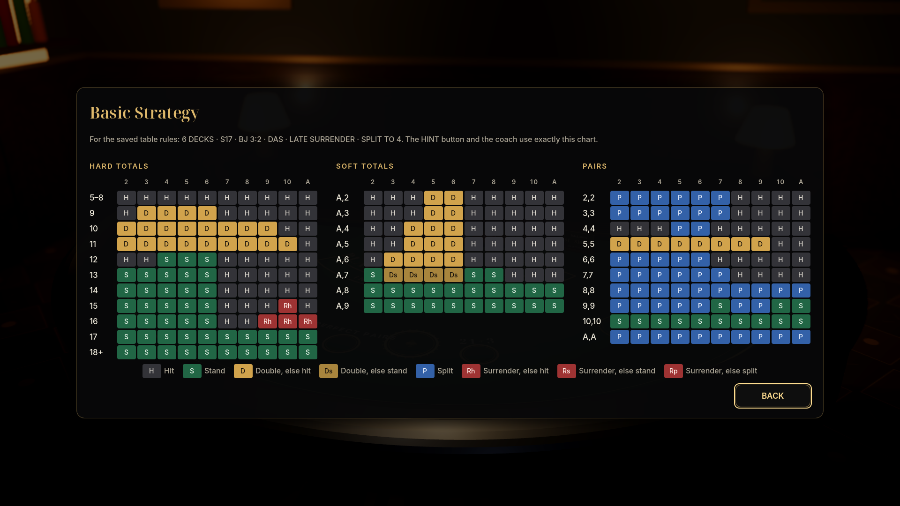 |
| 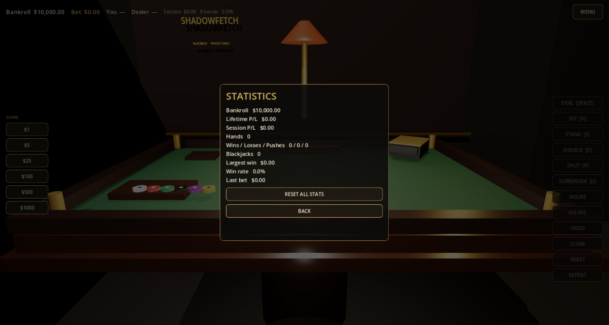 | 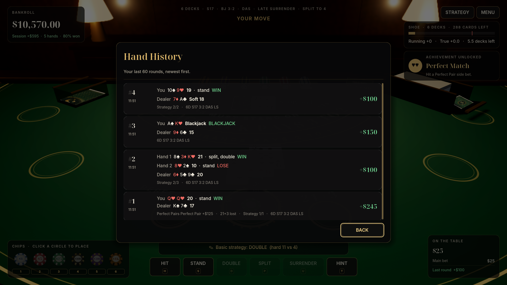 |
| 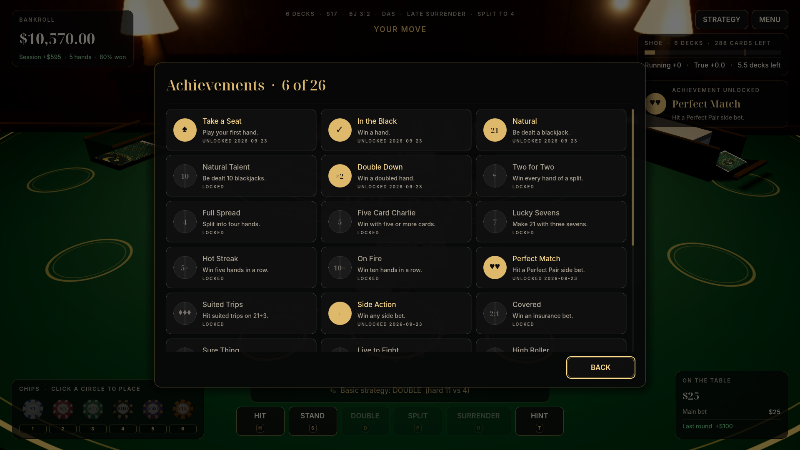 | 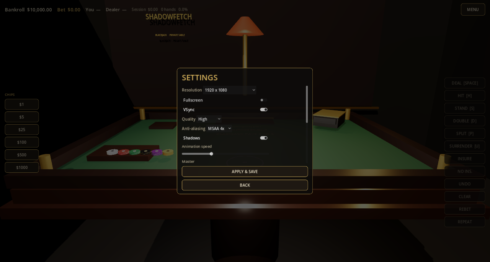 |

## Install

Download `shadowfetch-blackjack-3.0.0-linux-x86_64.tar.gz` from the
[latest release](https://github.com/Shadowfetchapps/shadowfetch-blackjack/releases/latest), then:

```bash
tar -xzf shadowfetch-blackjack-3.0.0-linux-x86_64.tar.gz
cd shadowfetch-blackjack-3.0.0-linux-x86_64
./tools/install-user.sh
```

This installs, for the current user only:

- `~/.local/bin/shadowfetch-blackjack`
- `~/.local/share/applications/com.shadowfetch.Blackjack.desktop`
- `~/.local/share/icons/hicolor/*/apps/shadowfetch-blackjack.{png,svg}`

Launch **Shadowfetch Blackjack** from your application menu, or run `shadowfetch-blackjack`.
Remove it with `./tools/uninstall-user.sh` (settings, statistics and achievements are kept).

Requirements: Linux x86_64 and a Vulkan-capable GPU.

## How to play

Beat the dealer without going over 21. Pick a chip (or press **1–6**) and click the betting circle — or just click
the chip to add it to your main bet — then press **Space** to deal. The full rules, payouts and side-bet tables are
in the in-game **How to Play** page and in [docs/RULES.md](docs/RULES.md).

### Controls

| Action | Keyboard | Gamepad |
| --- | --- | --- |
| Deal | Space / Enter | Y |
| Repeat last bet and deal | R | X |
| Add selected chip / choose chip | click · 1–6 | A · LB / RB |
| Undo / clear bet | Z / X | B / Back |
| Hit / stand | H / S | A / B |
| Double / split | D / P | X / Y |
| Surrender / hint | U / T | LB / RB |
| Insurance or even money: yes / no | Y / N | A / B |
| Next hand: rebet & deal / new bet | Space / Enter | Y / A |
| Camera: seated ↔ overhead | C | Back (during a hand) |
| How to Play | F1 | |
| Screenshot to `~/Pictures` | F12 | |
| Pause / back | Esc | Start / B |

Right-click a betting circle to take your last chip back from it. Menus work with the mouse, keyboard or gamepad.

## Build from source

Requirements: [Godot 4.7](https://godotengine.org/) (targets 4.7.2), Linux x86_64. Python 3 with Pillow/numpy/scipy
and ffmpeg are only needed to regenerate the artwork and audio.

```bash
./tools/run_tests.sh          # unit tests, 200k-hand simulation, headless game smoke test
godot --path .                # play from source
./tools/export_linux.sh       # release binary in export/linux/
./tools/package_release.sh    # versioned tarball + SHA-256 in export/
```

`SHADOWFETCH_BJ_HOME=/some/dir` redirects settings and saves (the test suite uses it so developer runs never touch
your real files). `SF_BJ_QA=shots SF_BJ_QA_OUTPUT=dir godot --path .` replays the scripted walkthrough that produced
the screenshots above.

Regenerating assets (all original, deterministic):

```bash
python3 tools/generate_cards.py   # 104 card faces + 4 backs
python3 tools/generate_chips.py   # chip faces, edge bands, HUD chips
python3 tools/generate_audio.py   # music, ambience, effects
python3 tools/side_bet_edges.py   # exact side-bet house edges
./tools/generate-icons.sh         # hicolor PNG icons from icon.svg
```

## Documentation

| | |
| --- | --- |
| [ARCHITECTURE.md](ARCHITECTURE.md) | How the engine, table, UI and stores fit together |
| [docs/RULES.md](docs/RULES.md) | Game rules, table rules, payouts, limits |
| [docs/ENGINE.md](docs/ENGINE.md) | Rules engine API and round flow |
| [docs/SHOE.md](docs/SHOE.md) | Shoe, cut card, conservation, mid-round reshuffle |
| [docs/BETTING.md](docs/BETTING.md) | Spots, chips, limits, rebet, rebuy |
| [docs/SIDE_BETS.md](docs/SIDE_BETS.md) | Perfect Pairs and 21+3 with exact house edges |
| [docs/STRATEGY.md](docs/STRATEGY.md) | Basic strategy engine, coach, chart |
| [docs/COUNTING.md](docs/COUNTING.md) | Hi-Lo trainer |
| [docs/PRESENTATION.md](docs/PRESENTATION.md) | 3D table, animation choreography, camera, lighting |
| [docs/UI.md](docs/UI.md) | HUD, menus, tutorial, accessibility |
| [docs/AUDIO.md](docs/AUDIO.md) | Synthesized music and effects |
| [docs/SAVE.md](docs/SAVE.md) | Settings, statistics, history, achievements, migration |
| [docs/TESTS.md](docs/TESTS.md) | Test suites, simulation, smoke test, edge check |
| [docs/ASSETS.md](docs/ASSETS.md) | Asset provenance and licences |
| [docs/RELEASING.md](docs/RELEASING.md) | Versioning, packaging and publishing |

## License

MIT (see [LICENSE](LICENSE)). All artwork, audio, geometry and code are original to this project and generated by
the scripts in `tools/`. Bundled fonts (Inter, Noto Serif Display, Noto Sans Symbols 2) are under the SIL Open Font
License 1.1 — see [assets/fonts/](assets/fonts/).

## Disclaimer

This is a single-player video game played with fictional chips. It is not a gambling service and offers no
real-money wagering or prizes. If gambling stops being fun for you or someone you know, local support services can help.
