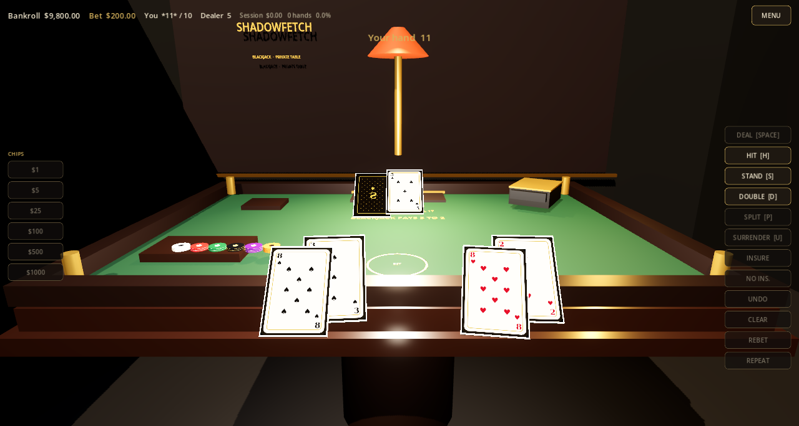

# Shadowfetch Blackjack

Premium standalone **3D blackjack** for Linux. Native Godot 4 / Vulkan desktop app — not a web page, not Electron.

You play seated at a cinematic casino table with readable 3D cards, tactile chips, and a rules-correct six-deck shoe. **All chips are fictional.** There is no cash-out, no deposits, and no real-money gambling.




**Version:** 2.0.0
**App name:** Shadowfetch Blackjack

## Features

- Rebuilt black/gold/deep-green private-table environment with branded wall, refined lighting, restrained bloom, shoe, tray, discard, and dealer station
- Enlarged full-deck card faces with physical edges, backs, deal / flip / split / reveal / clear motion, and seated-camera readability
- Chips: $1 / $5 / $25 / $100 / $500 / $1000, stack, undo, clear, rebet, repeat
- $10,000 starting fictional bankroll, persisted stats, reset option
- Six-deck shoe, real shuffle, cut card, reshuffle
- Dealer stands on **all 17s** by default; optional H17 table rule
- Blackjack pays **3:2**, insurance **2:1**, DAS, split to four hands, conventional split aces
- Optional late surrender with exact half-wager integer settlement
- Context-sensitive HUD and keyboard shortcuts
- Master / Music / FX / Ambient volumes, mute, graphics quality, resolution, fullscreen, vsync, AA, shadows, animation speed
- Beginner tutorial and How To Play
- User-local Linux install (`.desktop` + icon sizes)

## Controls

| Key | Action |
| --- | --- |
| Space | Deal |
| H | Hit |
| S | Stand |
| D | Double |
| P | Split |
| U | Surrender |
| R | Repeat last bet and deal |
| Esc | Pause / menu |

Chip buttons (and the 3D tray) add to the wager. Invalid shortcuts are ignored.

## Rules (this table)

- Six decks, shuffled; a cut card triggers a reshuffle after the current hand
- Dealer stands on hard and soft 17
- Optional H17 and late surrender are configurable in Settings → Table Rules and apply on the next deal
- Natural blackjack pays 3:2; both sides blackjack is a push
- Split matching **ranks** only, maximum four hands
- Double after split allowed; split aces receive one card each and cannot be hit, doubled, or resplit
- Insurance is offered on a dealer Ace for half the original bet
- Bankroll is tracked in integer cents and cannot go negative

## Install (user-local)

From a release build or a local export:

```bash
./tools/install-user.sh
```

This installs:

- `~/.local/bin/shadowfetch-blackjack`
- `~/.local/share/applications/com.shadowfetch.Blackjack.desktop`
- `~/.local/share/icons/hicolor/*/apps/shadowfetch-blackjack.png`

Launch **Shadowfetch Blackjack** from your app menu, or run `shadowfetch-blackjack` if `~/.local/bin` is on `PATH`.

No configuration is required on first launch.

To remove application files while preserving settings and statistics:

```bash
./tools/uninstall-user.sh
```

## Source, build, test

Requirements: [Godot 4.7](https://godotengine.org/) (this project targets 4.7.2), Linux x86_64, Vulkan.

```bash
# Engine tests + 200k simulated hands
./tools/run_tests.sh

# Editor / play
godot --path .

# Release export
./tools/export_linux.sh

# Versioned tarball + SHA-256 checksum
./tools/package_release.sh
```

`SHADOWFETCH_BJ_HOME` redirects settings/stats for tests so developer runs do not touch your real save files.

## Architecture

The rules engine is independent of the 3D table. See `docs/` for engine, shoe, betting, presentation, save format, asset provenance, and tests.

```
scripts/engine/     shoe, hands, payouts, legal actions
scripts/save/       settings + stats (corrupt-safe)
scripts/table/      procedural table, cards, chips, camera
scripts/ui/         HUD, menus, tutorial
scripts/game/       table session / animation orchestration
tests/              headless Godot suite + large simulation
```

## License

MIT. Card faces, card back, table geometry, icon, UI, and generated PCM audio are original project assets. No third-party casino IP or externally licensed media is shipped.

## Disclaimer

This is a single-player video game that uses **play money**. It is not a gambling service.
